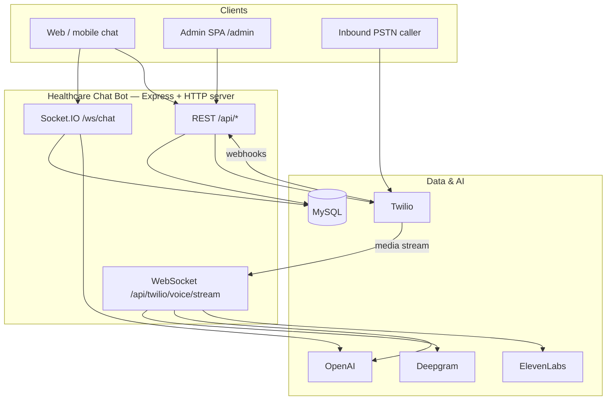

# Healthcare Chat Bot 

Backend platform for clinic-facing AI assistants: REST and WebSocket chat, Twilio voice/SMS, an admin dashboard, and a low-latency inbound phone bot powered by streaming speech and TTS.

## Features

| Area | Capabilities |
|------|----------------|
| **Chat** | OpenAI-powered conversations scoped per clinic, with knowledge-base context |
| **Realtime** | Socket.IO channel for text and voice turns (transcription + TTS) |
| **Inbound voice** | PSTN calls via Twilio Media Streams → Deepgram STT → OpenAI → ElevenLabs TTS, with barge-in and call persistence |
| **Twilio** | Outbound/inbound voice, SMS webhooks, call control (start, stop, mute) |
| **Admin UI** | React SPA at `/admin` — users, clinics, training/knowledge, call logs, dashboard stats |
| **Alerts** | Optional email (SMTP) and SMS (Twilio) notifications |

## Architecture



## Tech stack

- **Runtime:** Node.js, Express 5
- **Database:** MySQL via Sequelize
- **Realtime:** Socket.IO (chat), `ws` (Twilio Media Streams)
- **AI:** OpenAI (chat, transcription, TTS, classifiers)
- **Voice:** Deepgram (inbound STT), ElevenLabs (TTS), Twilio (telephony)
- **Admin:** React 18, Vite, Tailwind, Radix UI

## Prerequisites

- Node.js 18+ (20+ recommended)
- MySQL 8+
- API keys as needed for your deployment:
  - **Required for chat:** `OPENAI_API_KEY`
  - **Required for DB:** `DB_*` variables
  - **Inbound phone bot:** `DEEPGRAM_API_KEY`, Twilio account, per-clinic ElevenLabs config in admin
  - **Optional:** Twilio (SMS/voice), SMTP (email alerts)

## Quick start

### 1. Configure environment

```bash
cp .env.example .env
```

Edit `.env` with your database credentials, `OPENAI_API_KEY`, and any integrations you plan to use. See [Environment variables](#environment-variables) below.

### 2. Install dependencies

```bash
npm install
```

### 3. Initialize the database

Creates or updates tables via Sequelize:

```bash
npm run db:sync
```

### 4. Run the server

Builds the admin SPA and starts the API with file watching:

```bash
npm start
```

Default URL: `http://localhost:4000` (override with `PORT`).

- Health check: `GET /health`
- Admin dashboard: `http://localhost:4000/admin` (after build)

### Admin frontend — development

Run the API (`npm start`) in one terminal and the Vite dev server in another for hot reload:

```bash
npm run admin:dev
```

The dev server uses base path `/admin/`. Point `VITE_API_BASE_URL` at your backend if you proxy API calls separately.

Other scripts:

| Script | Description |
|--------|-------------|
| `npm run admin:build` | Production build → `admin-frontend/dist` |
| `npm run admin:preview` | Preview the built admin app |
| `npm run db:sync` | Sync schema only (no server) |

## Project structure

```
Healthcare Chat Bot /
├── src/
│   ├── server.js          # HTTP server, Socket.IO, inbound WS bootstrap
│   ├── app.js             # Express app, routes, admin static hosting
│   ├── controllers/       # Request handlers
│   ├── routes/            # Route definitions
│   ├── services/          # Business logic (chat, Twilio, voice pipeline, AI)
│   ├── models/            # Sequelize models
│   ├── realtime/          # Socket.IO + Twilio Media Stream handlers
│   ├── db/                # Sequelize connection & sync
│   └── middlewares/
├── admin-frontend/        # React admin SPA (served at /admin)
└── .env.example           # Environment template
```

### Data models

| Model | Purpose |
|-------|---------|
| `clinics` | Clinic profile, Twilio/ElevenLabs settings |
| `users` | Admin and clinic staff accounts |
| `knowledge` | Training content injected into prompts |
| `conversations` / `messages` | Web chat sessions |
| `calls` / `incoming_messages` | Inbound PSTN call logs and transcripts |

## Environment variables

Copy `.env.example` and set values for your environment. Grouped by concern:

### Core

| Variable | Description |
|----------|-------------|
| `PORT` | HTTP port (default `4000`) |
| `SERVER_URL` | Public base URL Twilio uses for `<Play>` audio (e.g. `https://api.example.com`) |
| `ALLOWED_ORIGINS` | Comma-separated CORS origins for REST |
| `ALLOWED_WS_ORIGINS` | Comma-separated origins for Socket.IO |

### Database

| Variable | Description |
|----------|-------------|
| `DB_HOST`, `DB_PORT`, `DB_USER`, `DB_PASSWORD`, `DB_NAME` | MySQL connection |
| `DB_CHARSET`, `DB_TIMEZONE` | Optional Sequelize settings |

### OpenAI

| Variable | Description |
|----------|-------------|
| `OPENAI_API_KEY` | **Required** for chat and voice features |
| `OPENAI_MODEL` | Chat completion model (default `gpt-5.4-mini`) |
| `OPENAI_SYSTEM_PROMPT` | Base system prompt for web chat |
| `OPENAI_MAX_COMPLETION_TOKENS` | Token limit for completions |
| `OPENAI_TRANSCRIPTION_MODEL` | Speech-to-text model |
| `OPENAI_TTS_MODEL`, `OPENAI_TTS_VOICE`, `OPENAI_TTS_FORMAT` | OpenAI TTS for Socket.IO voice replies |

### Inbound voice bot

| Variable | Description |
|----------|-------------|
| `DEEPGRAM_API_KEY` | Streaming STT for phone calls |
| `DEEPGRAM_MULTILINGUAL_MODEL` | Model for inbound STT (default `nova-3`; always used with `language=multi`) |
| `DEEPGRAM_FORCE_ENGLISH_STT` | Set `1` to disable multilingual mode and use English-only `DEEPGRAM_MODEL` |
| `DEEPGRAM_MODEL` | Used only when `DEEPGRAM_FORCE_ENGLISH_STT=1` (e.g. `nova-2-phonecall`) |
| `VAD_SILENCE_MS` | Endpointing silence (default `300`) |
| `BOT_SYSTEM_PROMPT` | Base prompt; clinic context appended automatically |
| `OPENAI_INBOUND_MODEL` | Optional faster model for phone-only |
| `TWILIO_INBOUND_VOICE_GREETING` | Greeting; `$clinic_name$` substituted from DB |
| `ELEVENLABS_INBOUND_TTS_MODEL` | Low-latency model (default `eleven_flash_v2_5`) |
| `TWILIO_STREAM_WSS_URL` | Optional dedicated WSS base if your proxy breaks upgrades |

### Twilio & alerts

| Variable | Description |
|----------|-------------|
| `TWILIO_CALL_CALLBACK_URL` | Status callback URL |
| `SMTP_*`, `ALERT_EMAIL` | Email alerts |
| Per-clinic Twilio/ElevenLabs keys | Configured via admin API, not only `.env` |

### Socket.IO

| Variable | Description |
|----------|-------------|
| `WEBSOCKET_CHAT_URL` | Socket.IO path (default `/ws/chat`) |
| `WS_PING_INTERVAL_MS`, `WS_PING_TIMEOUT_MS` | Keepalive tuning |

## API reference

All JSON APIs are under `/api`. Errors return `{ "error": "..." }` unless noted.

### Health

```
GET /health
→ { "status": "ok" }
```

### Chat (`/api/chat`)

| Method | Path | Body / params |
|--------|------|----------------|
| `POST` | `/conversation/start` | `{ "clinicId": 1, "userInfo": "..." }` → `{ "conversationId" }` |
| `POST` | `/message` | `{ "conversationId": 1, "text": "Hi", "messageType": "chat" }` |
| `GET` | `/conversation/:conversationId/messages` | Message history |
| `GET` | `/call/:callSid/status?clinicId=1` | Twilio call status |
| `POST` | `/end-call` | End an active Twilio call |

### Notifications (`/api/notifications`)

| Method | Path | Body |
|--------|------|------|
| `POST` | `/alert` | `{ "subject": "Alert", "message": "..." }` — email/SMS when configured |

### Admin auth (`/api/admin/auth`)

| Method | Path | Body |
|--------|------|------|
| `POST` | `/login` | `{ "email", "password" }` |

### Admin users (`/api/admin`)

| Method | Path |
|--------|------|
| `GET` | `/users` |
| `POST` | `/users` |
| `PUT` | `/users/:id` |
| `DELETE` | `/users/:id` |
| `PATCH` | `/users/:id/password` |

### Admin dashboard (`/api/admin/dashboard`)

| Method | Path | Notes |
|--------|------|-------|
| `GET` | `/stats` | Dashboard metrics |
| `GET` | `/clinics` | List clinics |
| `POST` | `/clinics/sync-external` | Sync from external API |
| `GET/PATCH` | `/clinics/:id/twilio` | Twilio config per clinic |
| `GET/PATCH` | `/clinics/:id/elevenlabs` | ElevenLabs API key |
| `GET` | `/clinics/:id/elevenlabs/voices` | Voice catalog |
| `GET` | `/clinics/:id/elevenlabs/preview` | TTS preview |
| `GET` | `/clinics/:clinicId/conversations` | Chat history by clinic |
| `GET` | `/conversations/:conversationId/messages` | Messages in a conversation |
| `GET` | `/calls` | Inbound call list |
| `GET` | `/calls/:callId/messages` | Transcript for a call |

### Admin knowledge (`/api/admin/knowledge`)

| Method | Path |
|--------|------|
| `GET` | `/` |
| `POST` | `/` |
| `PUT` | `/:id` |
| `PATCH` | `/:id/status` |
| `DELETE` | `/:id` |

### Twilio webhooks (`/api/twilio`)

Configured in the Twilio console. Key endpoints:

| Method | Path | Purpose |
|--------|------|---------|
| `POST` | `/voice/inbound` | Inbound call → TwiML + Media Stream |
| `WS` | `/voice/stream` | Media Stream audio pipeline |
| `POST` | `/voice/stream-status` | Stream lifecycle callbacks |
| `POST` | `/call-status` | Call status updates |
| `POST` | `/message/twiml` | Inbound SMS handling |
| `POST` | `/call/start`, `/call/stop`, `/call/mute` | Programmatic call control |

**Inbound phone setup**

1. Expose this server on HTTPS/WSS (e.g. ngrok or production load balancer).
2. Set the Twilio number **Voice webhook** to `POST https://YOUR_HOST/api/twilio/voice/inbound`.
3. Ensure `SERVER_URL` and optionally `TWILIO_STREAM_WSS_URL` match what Twilio can reach.
4. Configure clinic Twilio and ElevenLabs settings in the admin UI.

## Socket.IO (web chat)

- **Path:** `WEBSOCKET_CHAT_URL` (default `/ws/chat`)
- **Event:** `message` (client and server both use this event name)
- **Payload:** JSON object with a `type` field

### Client → server

| `type` | Fields | Description |
|--------|--------|-------------|
| `connect` | `clinicId`, `conversationId?`, `userInfo?` | Start or resume a session |
| `chat` | `message`, `conversationId?` | Text turn |
| `voice` | audio payload per `chatService` | Voice turn (STT + reply + TTS) |
| `pong` | — | Keepalive (ignored) |

### Server → client

Uniform shape: `type`, `status`, `conversationId`, `response`, `transcriptText`, `audio`, `audioMimeType`, `callSid`, `twilioIntent`, etc.

Example (text chat):

```json
// emit
{ "type": "chat", "message": "Hello", "conversationId": 1 }

// receive
{ "type": "chat", "status": "success", "response": "...", "conversationId": 1 }
```

## Admin UI

After `npm run admin:build` (included in `npm start`), open:

```
http://localhost:4000/admin
```

Pages include dashboard, clinics, users, training (knowledge base), and inbound call history. If the build is missing, `/admin` returns HTTP 503 with instructions to run `npm run admin:build`.

## Production notes

- Set `ALLOWED_ORIGINS` and `ALLOWED_WS_ORIGINS` in production; empty lists allow all origins (dev-friendly only).
- `npm start` runs `admin:build` on every start — for production, build once in CI and run `node src/server.js` if you prefer a slimmer process manager setup.
- Twilio webhooks have no `Origin` header and are always accepted by CORS middleware.
- OpenAI, Deepgram, and ElevenLabs calls fail gracefully or return errors when keys are missing; alert endpoints return `sent: false` without SMTP/Twilio credentials.
- On boot, the server connects to MySQL and runs Sequelize sync (same as `db:sync` logic).

## License

ISC
