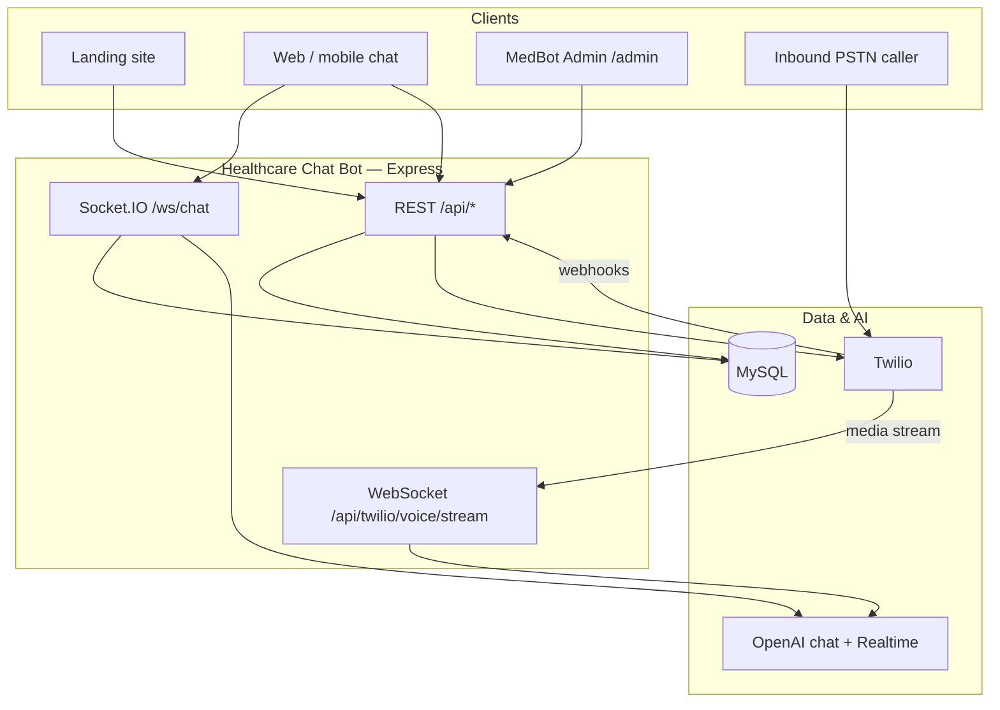

# Healthcare Chat Bot (MedBot)

Clinic-facing AI front desk platform: web chat, inbound PSTN voice, appointment booking, outbound campaign calling, and a clinical **MedBot Admin** console.

The Express API serves a marketing landing page at `/` and the admin SPA at `/admin`.

## Features

| Area | Capabilities |
|------|----------------|
| **Web chat** | OpenAI-powered conversations scoped per clinic, with knowledge-base context |
| **Realtime chat** | Socket.IO channel for text and voice turns (transcription + TTS) |
| **Inbound voice** | PSTN via Twilio Media Streams → **OpenAI Realtime** (STT + LLM + TTS in one session), barge-in, call persistence |
| **Agents** | Full bot profiles — models, voice, Twilio, meetings, flows, knowledge; **duplicate agent** into a prefilled create form |
| **Conversation flows** | Visual graph builder (Start → nodes → End hangs up); **duplicate flow** with deep-copied graph |
| **Campaigns** | Scheduled outbound dialing; patient Excel import / API sync; **duplicate campaign** (config only — patients not copied) |
| **Appointments & doctors** | Clinic schedules, booking from chat/phone, doctor roster |
| **Admin UI** | React SPA at `/admin` — dashboard, clinics, agents, flows, campaigns, calls, audit logs |
| **Audit logs** | Access trail (who / what / when / where), filters, selectable page size, clear-all |
| **Alerts** | Optional email (SMTP) and SMS (Twilio) notifications |

## Architecture


```mermaid
flowchart TB
  subgraph clients [Clients]
    Landing[Landing site]
    WebChat[Web / mobile chat]
    Admin[MedBot Admin /admin]
    Phone[Inbound PSTN caller]
  end

  subgraph platform [Healthcare Chat Bot — Express]
    API[REST /api/*]
    SIO[Socket.IO /ws/chat]
    WS[WebSocket /api/twilio/voice/stream]
  end

  subgraph data [Data & AI]
    MySQL[(MySQL)]
    OpenAI[OpenAI chat + Realtime]
    Twilio[Twilio]
  end

  Landing --> API
  WebChat --> SIO
  WebChat --> API
  Admin --> API
  Phone --> Twilio
  Twilio -->|webhooks| API
  Twilio -->|media stream| WS

  API --> MySQL
  SIO --> MySQL
  SIO --> OpenAI
  WS --> OpenAI
  API --> Twilio
```

## Tech stack

- **Runtime:** Node.js, Express 5
- **Database:** MySQL via Sequelize
- **Realtime:** Socket.IO (web chat), `ws` (Twilio Media Streams)
- **AI:** OpenAI (chat completions, transcription/TTS for Socket.IO voice, **Realtime** for inbound PSTN)
- **Telephony:** Twilio (inbound/outbound voice, SMS webhooks)
- **Admin / landing:** React 18, Vite, TypeScript, Tailwind, Radix/shadcn, Framer Motion, Recharts

## Prerequisites

- Node.js 18+ (20+ recommended)
- MySQL 8+
- API keys as needed:
  - **Required for chat/voice:** `OPENAI_API_KEY`
  - **Required for DB:** `DB_*` variables
  - **Inbound phone:** Twilio account + public HTTPS/WSS (`SERVER_URL`, optional `TWILIO_STREAM_WSS_URL`)
  - **Optional:** SMTP (email alerts), Twilio SMS

## Quick start

### 1. Configure environment

```bash
cp .env.example .env
```

Edit `.env` with database credentials, `OPENAI_API_KEY`, and any integrations you plan to use. See [Environment variables](#environment-variables).

### 2. Install dependencies

```bash
npm install
```

### 3. Initialize the database

```bash
npm run db:sync
```

### 4. Run the server

Builds the landing + admin SPAs and starts the API with file watching:

```bash
npm start
```

Default URL: `http://localhost:4000` (override with `PORT`).

| URL | Purpose |
|-----|---------|
| `GET /health` | Health check |
| `http://localhost:4000/` | Landing site |
| `http://localhost:4000/admin` | MedBot Admin (after build) |

### Frontend development

Run the API (`npm start` or `node src/server.js` after a build) in one terminal, then:

```bash
npm run admin:dev      # Vite HMR for admin (base /admin/)
npm run landing:dev    # Vite HMR for landing
```

| Script | Description |
|--------|-------------|
| `npm start` | Build landing + admin, then `nodemon src/server.js` |
| `npm run landing:build` | Production landing → `landing-frontend/dist` |
| `npm run admin:build` | Production admin → `admin-frontend/dist` |
| `npm run admin:preview` | Preview built admin app |
| `npm run db:sync` | Sync schema only |
| `npm run signaling:build` | Obfuscate signaling bundle |

## Project structure

```
mediback/
├── src/
│   ├── server.js          # HTTP server, Socket.IO, inbound WS bootstrap
│   ├── app.js             # Express app, routes, static hosting
│   ├── controllers/       # Request handlers
│   ├── routes/            # Route definitions
│   ├── services/          # Chat, Twilio, OpenAI Realtime, campaigns, audit
│   ├── models/            # Sequelize models
│   ├── realtime/          # Socket.IO + Twilio Media Stream handlers
│   ├── db/                # Sequelize connection & sync
│   └── middlewares/
├── admin-frontend/        # MedBot Admin SPA → /admin
├── landing-frontend/      # Marketing landing → /
└── .env.example
```

### Data models (high level)

| Area | Models / purpose |
|------|------------------|
| Clinics & staff | Clinics, users, doctors |
| Bot config | Agents, conversation flows, knowledge |
| Outreach | Campaigns, campaign contacts / patients |
| Sessions | Conversations, messages, calls |
| Care | Appointments |
| Compliance | Audit logs |

## MedBot Admin

After build, open `http://localhost:4000/admin`.

| Page | Path | Notes |
|------|------|-------|
| Dashboard | `/admin/dashboard` | KPIs, channel chart (7/30/60d), today’s appointments, clinic performance, inbox |
| Clinics | `/admin/clinics` | Profiles, themes, greetings, integrations |
| Appointments | `/admin/appointments` | Calendar / schedule |
| Users | `/admin/users` | Admin & clinic staff |
| Doctors | `/admin/doctors` | Provider roster |
| Agents | `/admin/agents` | Bot config wizard; **Duplicate agent** |
| Knowledge | `/admin/training` | Training content for prompts |
| Flows | `/admin/flows` | Visual conversation graphs; **Duplicate flow** |
| Campaigns | `/admin/campaigns` | Outbound dialing; **Duplicate campaign** |
| Campaign patients | `/admin/campaigns/:id` | Import / sync / contact status |
| Calls | `/admin/calls` | Inbound call history & transcripts |
| Audit logs | `/admin/audit-logs` | Access trail, filters, rows-per-page |

Sessions expire after idle timeout (see admin auth). If the admin build is missing, `/admin` returns HTTP 503 with build instructions.

## Environment variables

Copy `.env.example` and set values for your environment.

### Core

| Variable | Description |
|----------|-------------|
| `PORT` | HTTP port (default `4000`) |
| `SERVER_URL` | Public base URL Twilio uses for callbacks / `<Play>` audio |
| `ALLOWED_ORIGINS` | Comma-separated CORS origins for REST |
| `ALLOWED_WS_ORIGINS` | Comma-separated origins for Socket.IO |

### Database

| Variable | Description |
|----------|-------------|
| `DB_HOST`, `DB_PORT`, `DB_USER`, `DB_PASSWORD`, `DB_NAME` | MySQL connection |
| `DB_CHARSET`, `DB_TIMEZONE` | Optional Sequelize settings |

### OpenAI (chat & Socket.IO voice)

| Variable | Description |
|----------|-------------|
| `OPENAI_API_KEY` | **Required** |
| `OPENAI_MODEL` | Chat completion model |
| `OPENAI_SYSTEM_PROMPT` | Base system prompt for web chat |
| `OPENAI_MAX_COMPLETION_TOKENS` | Completion token limit |
| `OPENAI_TRANSCRIPTION_MODEL` | Speech-to-text for Socket.IO voice |
| `OPENAI_TTS_MODEL`, `OPENAI_TTS_VOICE`, `OPENAI_TTS_FORMAT` | TTS for Socket.IO voice replies |
| `CHAT_GREETING` | Default web chat greeting |

### Inbound voice (OpenAI Realtime + Twilio)

| Variable | Description |
|----------|-------------|
| `OPENAI_REALTIME_MODEL` | Realtime model (default `gpt-realtime-1.5`) |
| `OPENAI_REALTIME_VOICE` | Default voice (e.g. `marin`) |
| `OPENAI_REALTIME_TRANSCRIPTION_MODEL` | Input transcription model |
| `VAD_SILENCE_MS` | Endpointing silence (default `300`) |
| `BOT_SYSTEM_PROMPT` | Base prompt; clinic context appended automatically |
| `TWILIO_INBOUND_VOICE_GREETING` | Greeting; `$clinic_name$` (and related) substituted |
| `TWILIO_INBOUND_GREETING_CLINIC_FALLBACK` | Fallback clinic label |
| `INBOUND_END_CALL_ENABLED` | `1` = detect goodbye and hang up |
| `TWILIO_STREAM_WSS_URL` | Optional dedicated WSS base if the main proxy breaks upgrades |
| `TWILIO_CALL_CALLBACK_URL` | Status callback URL |

Agent-level OpenAI / Twilio / meeting credentials are configured in **Admin → Agents** (not only `.env`).

### Alerts & Socket.IO

| Variable | Description |
|----------|-------------|
| `SMTP_*`, `ALERT_EMAIL` | Email alerts |
| `APPOINTMENT_NOTIFY_EMAILS` | Appointment request notifications |
| `CALL_ANALYSIS_NOTIFY_EMAILS` | Post-call analysis BCC list |
| `WEBSOCKET_CHAT_URL` / `SOCKET_IO_PATH` | Socket.IO path (default `/ws/chat`) |
| `SOCKET_IO_*`, `WS_PING_*` | Keepalive / upgrade tuning |

## API reference

All JSON APIs are under `/api`. Errors typically return `{ "error": "..." }`.

### Health

```
GET /health
→ { "status": "ok" }
```

### Chat (`/api/chat`)

| Method | Path | Notes |
|--------|------|--------|
| `POST` | `/conversation/start` | Start conversation |
| `POST` | `/message` | Send text / chat message |
| `GET` | `/conversation/:conversationId/messages` | Message history |
| `GET` | `/call/:callSid/status` | Twilio call status |
| `POST` | `/end-call` | End an active Twilio call |

### Notifications (`/api/notifications`)

| Method | Path | Notes |
|--------|------|--------|
| `POST` | `/alert` | Email/SMS when configured |

### Admin auth (`/api/admin/auth`)

| Method | Path | Notes |
|--------|------|--------|
| `POST` | `/login` | `{ email, password }` |

### Admin resources

| Mount | Purpose |
|-------|---------|
| `/api/admin` | Users CRUD / password |
| `/api/admin/dashboard` | Stats, clinics, conversations, messages, calls, appointments |
| `/api/admin/knowledge` | Knowledge base |
| `/api/admin/agents` | Agent profiles, models, voices, test lab |
| `/api/admin/flows` | Conversation flow graphs |
| `/api/admin/campaigns` | Campaigns, contacts, import / sync |
| `/api/admin/doctors` | Doctors |
| `/api/admin/audit-logs` | Audit trail list / clear |

### Twilio webhooks (`/api/twilio`)

| Method | Path | Purpose |
|--------|------|---------|
| `POST` | `/voice/inbound` | Inbound call → TwiML + Media Stream |
| `WS` | `/voice/stream` | Media Stream ↔ OpenAI Realtime |
| `POST` | `/voice/stream-status` | Stream lifecycle |
| `POST` | `/call-status` | Call status updates |
| `POST` | `/message/twiml` | Inbound SMS |
| `POST` | `/call/start`, `/call/stop`, `/call/mute` | Programmatic call control |

**Inbound phone setup**

1. Expose this server on HTTPS/WSS (e.g. ngrok or production load balancer).
2. Set the Twilio number **Voice webhook** to `POST https://YOUR_HOST/api/twilio/voice/inbound`.
3. Ensure `SERVER_URL` (and optionally `TWILIO_STREAM_WSS_URL`) match what Twilio can reach.
4. Configure agent / clinic Twilio settings in the admin UI.

## Socket.IO (web chat)

- **Path:** `WEBSOCKET_CHAT_URL` (default `/ws/chat`)
- **Event:** `message` (client and server)
- **Payload:** JSON object with a `type` field

### Client → server

| `type` | Description |
|--------|-------------|
| `connect` | Start or resume a session (`clinicId`, optional `conversationId` / `userInfo`) |
| `chat` | Text turn |
| `voice` | Voice turn (STT + reply + TTS) |
| `pong` | Keepalive |

### Server → client

Uniform shape includes `type`, `status`, `conversationId`, `response`, `transcriptText`, `audio`, etc.

```json
// emit
{ "type": "chat", "message": "Hello", "conversationId": 1 }

// receive
{ "type": "chat", "status": "success", "response": "...", "conversationId": 1 }
```

## Production notes

- Set `ALLOWED_ORIGINS` and `ALLOWED_WS_ORIGINS` in production; empty lists allow all origins (dev-only).
- `npm start` rebuilds landing + admin on every start — for production, build in CI and run `node src/server.js` under a process manager if you prefer.
- Twilio webhooks have no `Origin` header and are accepted by CORS middleware.
- OpenAI / Twilio / SMTP calls fail gracefully when credentials are missing.
- On boot, the server connects to MySQL and runs Sequelize sync (same idea as `db:sync`).

## License

ISC
